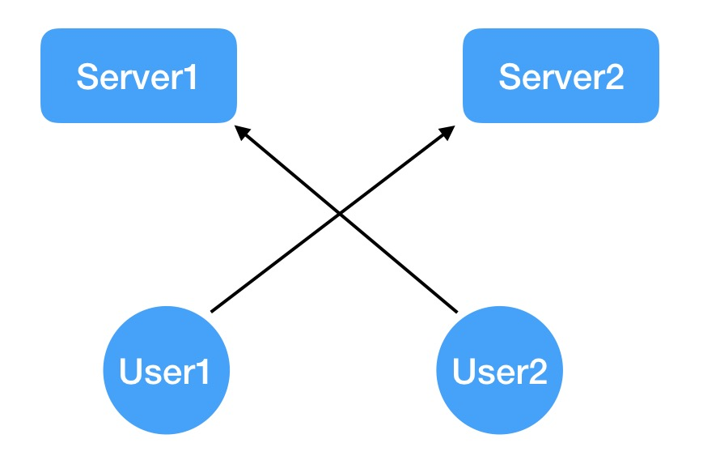
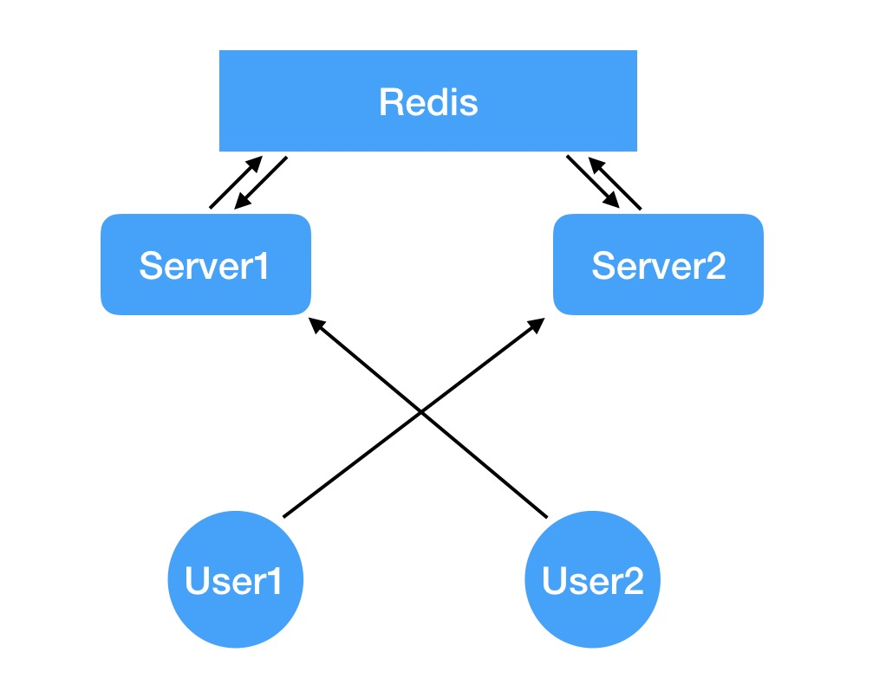

#  Sping Boot WebSocket 实战  2


继续上次的内容， 上次我们只是简单的实现了最基本的点对点通信，但是实际上的玩具级应用也要比这个复杂。本文继续深入实际生产中所应用的 *Spring WebSocket*


考虑如下情况：



如上图，我们的应用部署在两台服务器上， 现在有两个用户同时发起了 *websocket* 连接，经过 *Nginx* 转发之后 ***user1*** 与 ***server2*** 建立了连接，而 ***user2*** 与 ***Server1*** 建立了连接。 这个时候， ***user1*** 向 ***user2*** 发送了一条消息，但是，因为 ***server2*** 并没有 ***user2*** 的连接，所以无法将消息推送给 ***user2***。这样一来，整个应用都陷入了无法正常工作的状态。


从单机氏思维向分布式思维转换是一个必然而重要的过程，我们必须时刻考虑如果我们的程序在多台机器上能否正常的运行。


所以，这里我们需要让服务器之间可以进行通信，一般来讲，服务器之间通信就是建立 *tcp* 连接来传输数据，比如  *Hadoop* 与 *Spark* ，在 *Reduce* 阶段需要把自己的计算结果汇集，必然需要各个节点之间的相互通信，使用 *Tcp 长连接* 安全又高效。 但是这种方式实现起来相对麻烦，我们大可不必这么做， 这里可以借用第三方中间件来完成消息的接受与发送工作，自然而然的我们可以联想到 ***消息队列***，比如 *RabbitMQ*、 *Kafka*。不过，我们还有一个更简单的方式，不用使用消息队列，而使用 *Redis* 的 *Pub/Sub* 功能。整体结构如下：




在这种架构中，我们使用 *redis* 来作为消息队列，利用它的 ***订阅/发布*** 功能来实现我们分布式的点对点通信。所有的服务器都将收到的消息发送给 *redis*，再由 *redis* 决定需要推送给哪一台服务器。通常情况，所有的服务器都会订阅 *redis* 的该条通道，所以相当于*redis* 在这个通道上进行了一次广播，所有服务器都会受到这条消息，之后校验消息的接受者是否与自己建立了连接，如果是则发送消息，如果没有则丢弃该消息。


下面我们来看一下具体实现：👇，首先需要在 *Spring boot* 应用启动的配置类中添加如下：

```java

  @Bean
  RedisMessageListenerContainer container(RedisConnectionFactory connectionFactory, MessageListenerAdapter adapter) {
    RedisMessageListenerContainer container = new RedisMessageListenerContainer();
    container.setConnectionFactory(connectionFactory);
    // websocket/message 为发布订阅的通道
    container.addMessageListener(adapter, new ChannelTopic("websocket/message"));
    return container;
  }

  @Bean
  public MessageListenerAdapter listenerAdapter(MessageWebSocketService webSocketService) {
    // 注意，这里 MessageWebSocketService 必须被注入，按照上回的方法，它是一个 @Service
    // 这里配置了接受消息的类和具体方法。框架会使用反射获取到方法并用代理去调用它。
    MessageListenerAdapter adapter= new MessageListenerAdapter(webSocketService, "redisMessageReceiver");
    // 这里是一个大坑，但是只有开发环境会遇到，序列化的时候会遇到两个不同类加载器加载的父子类(其中一个是开发环境独有的，当你修改完文件即可编译热启动的 restartClassLoader)，然后使用 isInstance 会返回 false，这条消息变不会广播。
    adapter.setSerializer(new JdkSerializationRedisSerializer(this.getClass().getClassLoader()));
    return adapter;
  }

```

要发布消息，可以使用低级 *RedisConnection* 或高级的 *RedisTemplate* 。这两个实体提供的 *publish* 方法接受作为参数需要发送的消息以及目标通道。但是 *RedisConnection* 需要原始数据（字节数组）时，*RedisTemplate* 允许任意对象作为消息传入。同时，使用低级的发布/订阅时线程是阻塞的：

> Spring Data Redis中的订阅命令是阻塞的。也就是说，要求订阅的连接，将导致当前线程阻塞，因为它会开	始等待消息-只有在订购被取消的线程将被释放，这是一个额外的线程调用 unsubscribe 或 pUnsubscribe 在上相同的连接。由于其阻塞性质，低级订阅没有吸引力，因为它需要为每个单独的监听者进行连接和线程管理。为了缓解这个问题，Spring Data提供 RedisMessageListenerContainer 了代表用户的所有繁重工作 

*RedisMessageListenerContainer* 充当消息监听器容器，它用于接收来自 *Redis* 通道的消息，并驱动 *MessageListener* 。侦听器容器负责所有的消息接收线程，并派发到侦听器进行处理。


随后我们需要定义小的接受方法 ***redisMessageReceiver()***

```java
  public void redisMessageReceiver(PushMessageVO message) {
      // 发送消息，具体代码见 第一回
      sendMessageToUser(message.getUserLdap(), message.getMessageVOS());
      
  messageService.markAsSent(message.getMessageVOS().stream().map(MessageVO::getId).collect(Collectors.toList()));
    // 标为已经发送
  }
```


至此，大功告成。

